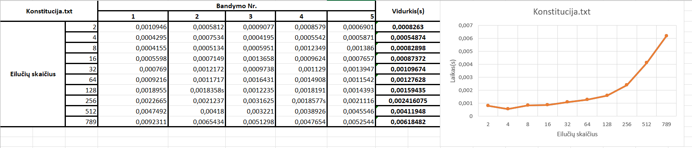

# Blockchain

## void PaddedInput(string& simboliu_seka)
- prie **simboliu_seka** yra pridedamas string'as **"11111"**.

## Maišos funkcija
```cpp
string Maisos_funkcija(string& simboliu_seka){

    const unsigned int size = simboliu_seka.length();
    bitset<8> bit_map(size);
    string nauja_simboliu_seka;
    const unsigned int hash_parts = 4;

    unsigned long long hashes[hash_parts] = {
        0x6a09e667f3bcc908,
        0x9b05688c2b3e6c1f,
        0x1f83d9abfb41bd6b,
        0x5be0cd19137e2179
    };

    PaddedInput(simboliu_seka);

    for(char c : simboliu_seka){
        bit_map = bitset<8>(c);
        bit_map.flip();
        for(int i = 0; i < hash_parts; i++){
            hashes[i] ^= bit_map.to_ulong() * 0x9e3779b97f4a7c15;
            hashes[i] = (hashes[i] << 32) | (hashes[i] >> 32);
        }
    }

    ostringstream oss;
    for(int i = 0; i < hash_parts; i++){
        oss << hex << setw(16) << setfill('0') << hashes[i];
    }

    return oss.str();
}
```
- **string& simboliu_seka** – Tekstas, kuris yra hash'inamas.
- **bitset<8> bit_map(size)** – Kiekvienas simbolis verčiamas į 8 bitų seką, bit_map(size) talpina simboliu_seka.length()*8 bitų.
```cpp
    unsigned long long hashes[hash_parts] = {
        0x6a09e667f3bcc908,
        0x9b05688c2b3e6c1f,
        0x1f83d9abfb41bd6b,
        0x5be0cd19137e2179
    };
```
- **for(char c : simboliu_seka)** – iteruoja per kiekvieną simbolį **simboliu_seka** string'e

 - **bit_map = bitset<8>(c)** konvertuoja simbolį į 8 bitų seką.
 - **bit_map.flip()** paverčia 0 –> 1 ir 1 –> 0.
 - **hashes[i] ^= bit_map.to_ulong() * 0x9e3779b97f4a7c15** naudojmas XOR tarp hashes[i] reiksmes ir **bit_map.to_ulong() * 0x9e3779b97f4a7c15**, kur **bit_map.to_ulong()** yra bitų sekos konvertavimas į dešimtainį skaičių.
 - **hashes[i] << 32** pastuma 32  bit'us į kairę.
 - **hashes[i] >> 32** pastuma 32  bit'us į dešinę.
 - **oss << hex << setw(16) << setfill('0') << hashes[i];** – į ostringstream objektą yra įrašoma 16 simbolių hex vertė iš **hashes[i]**(taip iteruoja 4 kartus iš viso), jei truksta simbolių, tada pripildoma tiek nulių kiek jų truksta.
 ```cpp
    for(int i = 0; i < hash_parts; i++){
        oss << hex << setw(16) << setfill('0') << hashes[i];
    }
```
- **oss.str()** – grąžina reikšmę kaip string'ą.

## Skaitymas iš failo
```cpp
string Failo_apdorojimas(string failo_pavadinimas){
    ifstream DF(failo_pavadinimas);
    failo_pavadinimas = "";

    if(!DF.is_open()){
        __throw_runtime_error("Nepavyko atidaryti failo");
    }

    string line;
    while(getline(DF, line)){
        failo_pavadinimas += line;
        //cout << line << endl;
    }
    DF.close();
    //cout << failo_pavadinimas;
    return failo_pavadinimas;
}
```
- **string failo_pavadinimas** – failo pavadinimas
- Funkcija nuskaito visą failą kas eilute ir grąžina visa failo tekstą kaip string'ą.

## Tyrimas su Konstitucija.txt


## Tyrimas su SHA256, SHA1 ir md5 hash algoritmais
```cpp
Mano hash reiksme: ee9facff4a66a832361d09e8bb6a26d9e662d89c3fec97fe0e5d448e7b8f834c
Mano hash'o vykdymo laikas: 5.30728s

SHA256 reiksme: db8315d5227fb8f5eb32a1972619ec6d72289ac52029930ea2303c31c94114ca
sha256 hash'o vykdymo laikas: 1.80607s

SHA1 reiksme: d6ba1a743d3f91b0e319d8ed2feb41e6c25ef424
sha1 hash'o vykdymo laikas: 1.0268s

md5 reiksme: 552f7bd519da433c19bddf78e44f1e15
md5 hash'o vykdymo laikas: 1.21516s
```

